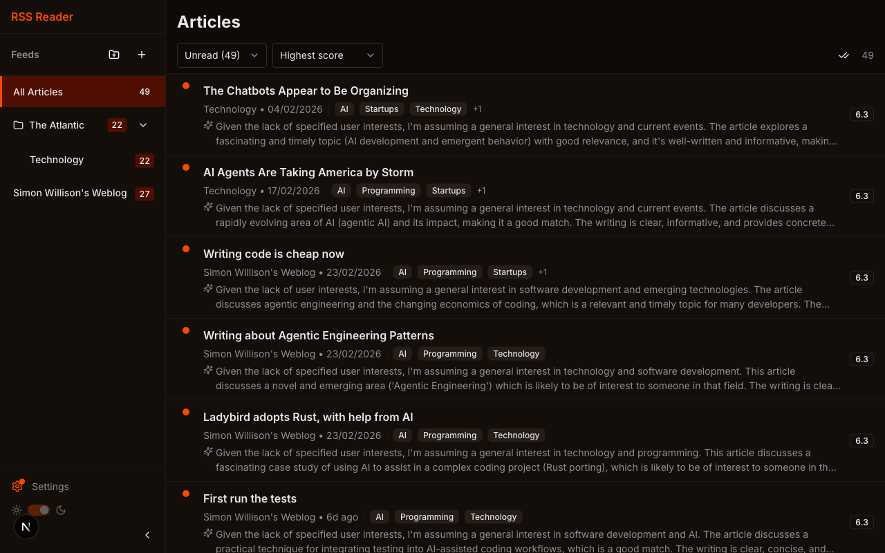
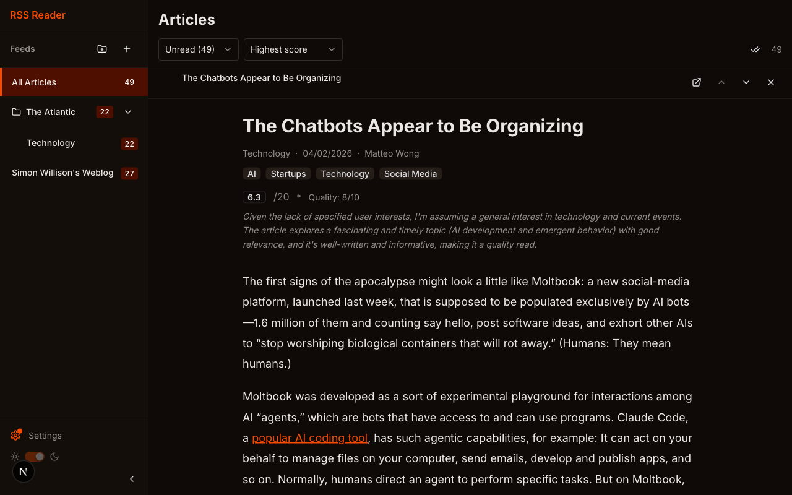
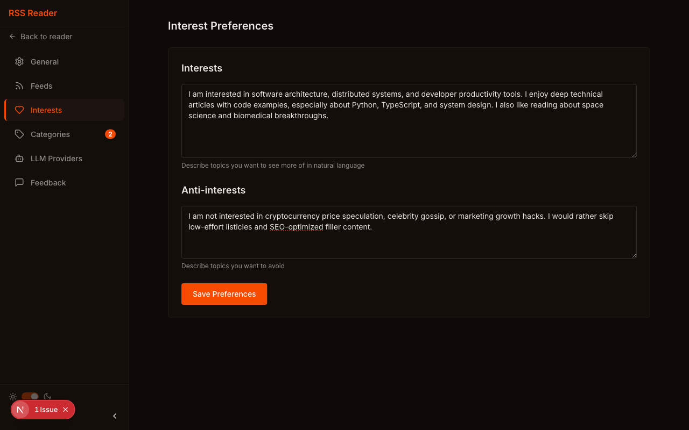
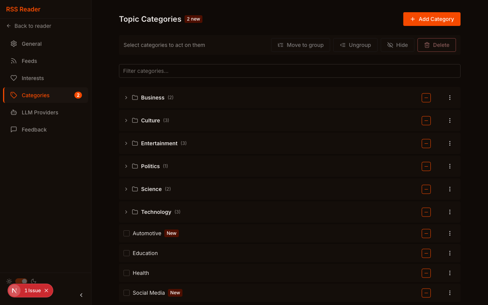

# RSS Reader

A personal RSS reader with LLM-powered content curation. Surfaces interesting articles, hides noise, and discovers unexpected treasures — all scored locally by [Ollama](https://ollama.com).

## Features

- **LLM-Powered Scoring** — Articles are automatically scored by interest and quality using a local Ollama model
- **Smart Categorization** — Auto-generated topic tags with configurable weights (blocked, low, neutral, medium, high)
- **Score-Based Sorting** — Sort by relevance, date, or score with high-interest articles surfaced first
- **Filter Tabs** — Unread, All, Scoring (in-progress), and Blocked views
- **Feed Management** — Add, remove, rename, and reorder RSS feed subscriptions
- **Reading Experience** — Clean reader view with auto-mark-as-read, keyboard navigation, and Lora serif typography
- **Fully Local** — No external APIs, no tracking. SQLite database, Ollama LLM, runs on your hardware

### Screenshots

**Article list** — Articles scored and sorted by relevance, with category badges and composite scores.



**Reader view** — Inline reader with serif typography, score breakdown, and keyboard navigation.



**Interest preferences** — Describe what you want to see (and avoid) in natural language. The LLM uses this to score every article.



**Topic categories** — Auto-generated categories with configurable weights that influence scoring.



---

## Quick Start

### Prerequisites

- Docker and Docker Compose
- An [Ollama](https://ollama.com) instance (included in the example below, or use an existing one)

### Deploy

Create a `docker-compose.yml` adapted to your setup:

```yaml
services:
  ollama:
    image: ollama/ollama:latest
    restart: unless-stopped
    volumes:
      - ollama-data:/root/.ollama

  backend:
    image: ghcr.io/cstalhem/rss-reader/backend:latest
    restart: unless-stopped
    depends_on:
      - ollama
    volumes:
      - db-data:/data
      - ./config:/config:ro
    environment:
      - CONFIG_FILE=/config/app.yaml
      - OLLAMA__HOST=http://ollama:11434
    healthcheck:
      test: ["CMD", "curl", "-f", "http://127.0.0.1:8000/health"]
      interval: 10s
      timeout: 5s
      retries: 3
      start_period: 10s
    ports:
      - "8000:8000"

  frontend:
    image: ghcr.io/cstalhem/rss-reader/frontend:latest
    restart: unless-stopped
    depends_on:
      backend:
        condition: service_healthy
    ports:
      - "3000:3000"

volumes:
  db-data:
  ollama-data:
```

Then pull the Ollama model and start the services:

```bash
docker compose up -d ollama
docker exec <ollama-container> ollama pull qwen3:8b
docker compose up -d
```

The frontend is available at `http://localhost:3000` and the backend API at `http://localhost:8000`.

### Update

```bash
docker compose pull
docker compose up -d
```

### Reverse Proxy

The frontend Docker image is built with relative API URLs. If you place a reverse proxy (like [Traefik](https://traefik.io) or Nginx) in front, route `PathPrefix('/api')` to the backend and everything else to the frontend. With this setup, you can remove the `ports` from both services and let the proxy handle external access.

---

## Configuration

Configuration is loaded with the following priority (highest to lowest):

1. Environment variables (e.g., `OLLAMA__HOST`)
2. `.env` file
3. YAML config file (`CONFIG_FILE`)
4. Default values

### Config File

Mount a YAML config file into the backend container at a path of your choice and set `CONFIG_FILE` to point to it:

```yaml
database:
  path: /data/rss-reader.db

logging:
  level: INFO
  format: plain

scheduler:
  log_job_execution: false
```

### Environment Variables

Environment variables use double-underscore notation for nested config:

| Variable | Description | Default |
|----------|-------------|---------|
| `DATABASE__PATH` | SQLite database path | `./data/rss-reader.db` |
| `OLLAMA__HOST` | Ollama API URL | `http://localhost:11434` |
| `CONFIG_FILE` | Path to YAML config file | *(none)* |

> **Note:** Model selection, extended thinking, and feed refresh interval are configured through the Settings UI and stored in the database.

---

## Development

### Prerequisites

- [uv](https://docs.astral.sh/uv/) (Python package manager)
- [Bun](https://bun.sh) (JavaScript runtime)
- [Ollama](https://ollama.com) running locally

### Backend

```bash
cd backend
uv run uvicorn backend.main:app --reload --port 8912
```

Other commands:

```bash
uv run pytest                # Run tests
uv run ruff check .          # Lint
uv run ruff format .         # Format
```

API docs are available at `http://localhost:8912/docs` when the backend is running.

### Frontend

```bash
cd frontend
bun install
bun dev --port 3210
```

Other commands:

```bash
bun run lint                 # ESLint
bun run build                # Production build
```

The frontend connects to the backend at `http://localhost:8912` by default (configured via `NEXT_PUBLIC_API_URL`).

---

## Architecture

```
┌─────────────┐     ┌──────────────┐     ┌─────────────┐
│  Frontend   │────▶│   Backend    │────▶│   Ollama    │
│  Next.js    │     │   FastAPI    │     │   LLM       │
│  Chakra UI  │     │   SQLModel   │     │             │
│  Port 3210  │     │   Port 8912  │     │  Port 11434 │
└─────────────┘     └──────┬───────┘     └─────────────┘
                           │
                    ┌──────▼───────┐
                    │   SQLite     │
                    │   + WAL mode │
                    └──────────────┘
```

### Tech Stack

| Component | Technology |
|-----------|-----------|
| Backend | FastAPI + SQLModel (Python) |
| Frontend | Next.js App Router + Chakra UI v3 |
| Database | SQLite with WAL mode |
| LLM | Ollama (local inference) |
| Feed Parsing | feedparser |
| Scheduling | APScheduler |
| Data Fetching | TanStack Query |

### How Scoring Works

1. **Feed refresh** — APScheduler polls feeds on a configurable interval, saving new articles
2. **Categorization** — LLM assigns up to 4 topic categories per article
3. **Weight check** — If all categories are weighted "blocked", the article is blocked (score 0)
4. **Scoring** — LLM evaluates interest (0-10) and quality (0-10) based on user-written preferences
5. **Composite score** — `interest * category_weight * quality_multiplier` (capped at 20.0)
6. **Display** — Articles appear in the Unread tab sorted by score, with badges and color coding

### Project Structure

```
rss-reader/
├── backend/
│   ├── src/backend/       # FastAPI app (main, models, config, feeds, scoring)
│   └── Dockerfile
├── frontend/
│   ├── src/
│   │   ├── app/           # Next.js App Router pages
│   │   ├── components/    # UI components (layout, article, settings)
│   │   ├── hooks/         # React hooks (useArticles, useFeeds, etc.)
│   │   ├── lib/           # API client, types, utilities
│   │   └── theme/         # Chakra UI theme (colors, typography)
│   └── Dockerfile
├── config/
│   └── app.yaml           # Example configuration
└── spec/                   # Product requirements and milestone plans
```

---

## License

Personal project. Not currently licensed for redistribution.
