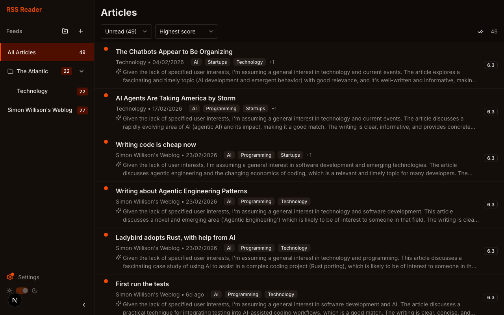
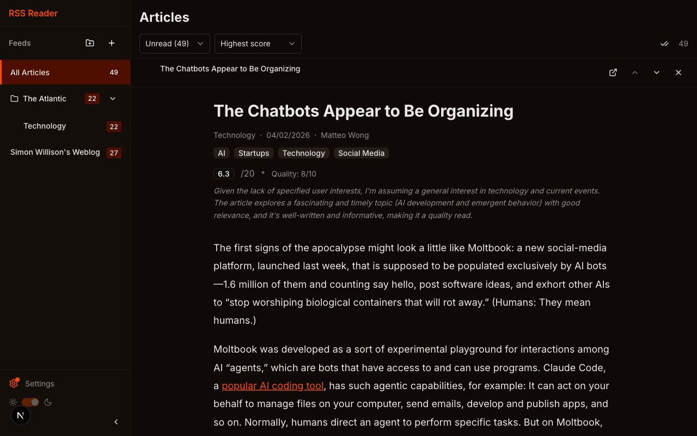
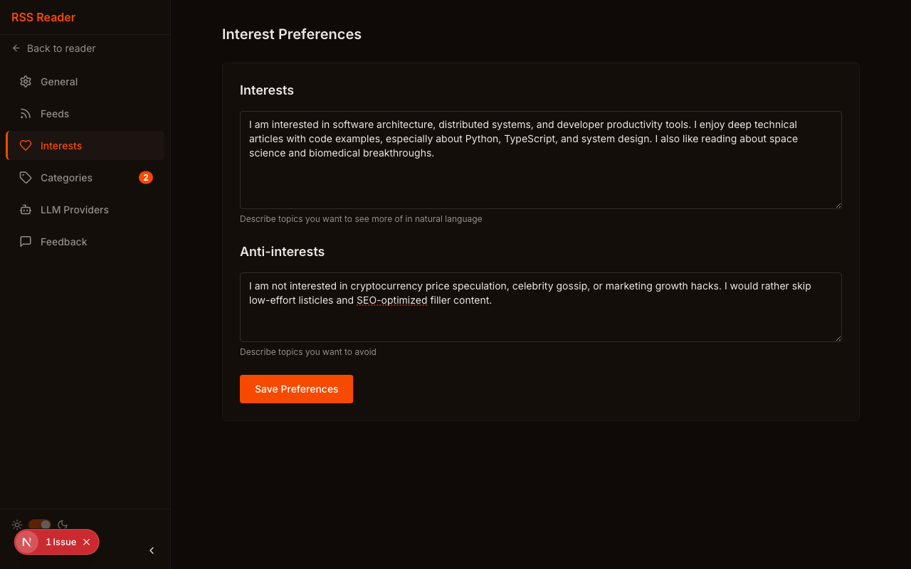
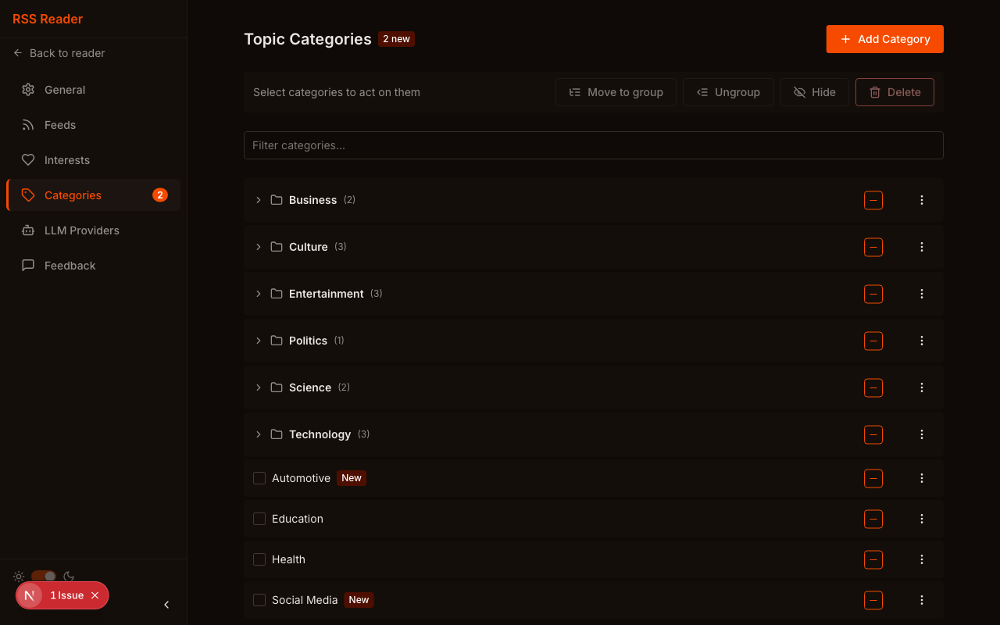

# RSS Reader

A personal RSS reader with LLM-powered content curation. Surfaces interesting articles, hides noise, and discovers unexpected treasures — scored by [Azure AI Foundry](https://azure.microsoft.com/en-us/products/ai-foundry).

## Features

- **LLM-Powered Scoring** — Articles are automatically scored by interest and quality using an Azure AI Foundry model
- **Smart Categorization** — Auto-generated topic tags with configurable weights (blocked, low, neutral, medium, high)
- **Score-Based Sorting** — Sort by relevance, date, or score with high-interest articles surfaced first
- **Filter & Sort** — Unread, All, Scoring, and Blocked views with score or date sorting
- **Feed Management** — Add, remove, rename, and reorder RSS feed subscriptions
- **Feed Folders** — Organize subscriptions into collapsible folder groups
- **Reading Experience** — Clean reader view with auto-mark-as-read, keyboard navigation, and Lora serif typography
- **Dark & Light Theme** — Toggle between dark and light modes
- **Self-Hosted** — No telemetry. SQLite database and app run on your hardware; LLM scoring calls Azure AI Foundry

### Screenshots

**Article list** — Articles scored and sorted by relevance, with category badges and composite scores.



**Reader view** — Inline reader with serif typography, score breakdown, and keyboard navigation.



**Interest preferences** — Describe what you want to see (and avoid) in natural language. The LLM uses this to score every article.



**Topic categories** — Auto-generated categories with configurable weights that influence scoring.



---

## Quick Start

### Prerequisites

- Docker and Docker Compose
- An [Azure AI Foundry](https://azure.microsoft.com/en-us/products/ai-foundry) endpoint and API key

### Deploy

> **⚠ Upgrading from v1:** v2 uses a fresh database schema with no migration path from v1 (ADR-0003). Start from an **empty** data volume — reusing a v1 SQLite database will fail at startup because its recorded migration revision isn't in the v2 chain. Re-adding your feeds is expected one-time work.

Create a `docker-compose.yml` adapted to your setup:

```yaml
services:
  backend:
    image: ghcr.io/cstalhem/rss-reader/backend:latest
    restart: unless-stopped
    volumes:
      - db-data:/data
      - ./config:/config:ro
    environment:
      - CONFIG_FILE=/config/app.yaml
      - DATABASE__PATH=/data/rss-reader.db
      - AZURE_OPENAI_ENDPOINT=https://<your-resource>.services.ai.azure.com
      - AZURE_OPENAI_API_KEY=<your-api-key>
    healthcheck:
      test: ["CMD", "curl", "-f", "http://127.0.0.1:8000/health"]
      interval: 10s
      timeout: 5s
      retries: 3
      start_period: 10s
    ports:
      - "8000:8000"

  frontend:
    image: ghcr.io/cstalhem/rss-reader/frontend:latest
    restart: unless-stopped
    depends_on:
      backend:
        condition: service_healthy
    ports:
      - "3000:3000"

volumes:
  db-data:
```

Then start the services:

```bash
docker compose up -d
```

The frontend is available at `http://localhost:3000` and the backend API at `http://localhost:8000`.

### Update

```bash
docker compose pull
docker compose up -d
```

### Reverse Proxy

The frontend Docker image is built with relative API URLs. If you place a reverse proxy (like [Traefik](https://traefik.io) or Nginx) in front, route `PathPrefix('/api')` to the backend and everything else to the frontend. With this setup, you can remove the `ports` from both services and let the proxy handle external access.

---

## Configuration

Configuration is loaded with the following priority (highest to lowest):

1. Environment variables (e.g., `DATABASE__PATH`)
2. `.env` file
3. YAML config file (`CONFIG_FILE`)
4. Default values

### Config File

Mount a YAML config file into the backend container at a path of your choice and set `CONFIG_FILE` to point to it:

```yaml
database:
  path: /data/rss-reader.db

logging:
  level: INFO
  format: plain

scheduler:
  log_job_execution: false

# Per-task Azure deployment routing (ADR-0002). The deployment names must
# match the deployments you created in your Azure AI Foundry resource;
# the endpoint and API key come from env vars, not this file.
llm:
  tasks:
    scoring:
      deployment: <your-scoring-deployment>
      batch_size: 5
    categorization:
      deployment: <your-categorization-deployment>
      batch_size: 10
    grouping:
      deployment: <your-grouping-deployment>
```

### Environment Variables

Environment variables use double-underscore notation for nested config:

| Variable | Description | Default |
|----------|-------------|---------|
| `DATABASE__PATH` | SQLite database path | `./data/rss-reader.db` |
| `AZURE_OPENAI_ENDPOINT` | Azure AI Foundry endpoint URL | *(none)* |
| `AZURE_OPENAI_API_KEY` | Azure AI Foundry API key | *(none)* |
| `CONFIG_FILE` | Path to YAML config file | *(none)* |

> **Note:** Per-task model routing is set in the YAML config file under `llm.tasks` (see above) — there is no model-selection UI. The feed refresh interval is stored in the database and adjustable through preferences.

---

## Development

### Prerequisites

- [uv](https://docs.astral.sh/uv/) (Python package manager)
- [Bun](https://bun.sh) (JavaScript runtime)
- An [Azure AI Foundry](https://azure.microsoft.com/en-us/products/ai-foundry) endpoint and API key

### Backend

```bash
cd backend
uv run uvicorn backend.main:app --reload --port 8912
```

Other commands:

```bash
uv run pytest                # Run tests
uv run ruff check .          # Lint
uv run ruff format .         # Format
```

API docs are available at `http://localhost:8912/docs` when the backend is running.

### Frontend

```bash
cd frontend
bun install
bun dev --port 3210
```

Other commands:

```bash
bun run lint                 # ESLint
bun run build                # Production build
```

The frontend uses relative API URLs — in dev, `next.config.ts` proxies `/api` requests to `http://localhost:8912` (no env var needed).

---

## Architecture

```
┌─────────────┐     ┌──────────────┐     ┌─────────────┐
│  Frontend   │────▶│   Backend    │────▶│  Azure AI   │
│  Next.js    │     │   FastAPI    │     │  Foundry    │
│  shadcn/ui  │     │   SQLModel   │     │             │
│  Port 3210  │     │   Port 8912  │     │             │
└─────────────┘     └──────┬───────┘     └─────────────┘
                           │
                    ┌──────▼───────┐
                    │   SQLite     │
                    │   + WAL mode │
                    └──────────────┘
```

### Tech Stack

| Component | Technology |
|-----------|-----------|
| Backend | FastAPI + SQLModel (Python) |
| Frontend | Next.js App Router + shadcn/ui + Tailwind v4 |
| Database | SQLite with WAL mode |
| LLM | Azure AI Foundry |
| Feed Parsing | feedparser |
| Scheduling | APScheduler |
| Data Fetching | TanStack Query |

### How Scoring Works

1. **Feed refresh** — APScheduler polls feeds on a configurable interval, saving new articles
2. **Categorization** — LLM assigns up to 4 topic categories per article
3. **Weight check** — If all categories are weighted "blocked", the article is blocked (score 0)
4. **Scoring** — LLM evaluates interest (0-10) and quality (0-10) based on user-written preferences
5. **Composite score** — `interest * category_weight * quality_multiplier` (capped at 20.0)
6. **Display** — Articles appear in the Unread tab sorted by score, with badges and color coding

### Project Structure

```
rss-reader/
├── backend/
│   ├── src/backend/       # FastAPI app (main, models, config, feeds, scoring)
│   └── Dockerfile
├── frontend/
│   ├── src/
│   │   ├── app/           # Next.js App Router pages
│   │   ├── components/    # UI components (layout, article, settings)
│   │   ├── hooks/         # React hooks (useArticles, useFeeds, etc.)
│   │   └── lib/           # API client, types, utilities
│   └── Dockerfile
├── config/
│   └── app.yaml           # Example configuration
├── docs/
│   └── *.png              # README screenshots
└── spec/                   # Product requirements and milestone plans
```

---

## License

Personal project. Not currently licensed for redistribution.
