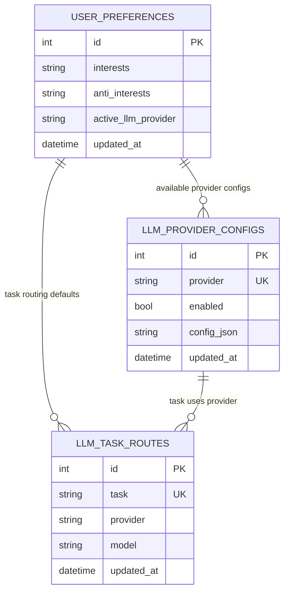

# feat: Rename Ollama Settings to LLM Providers with Pluggable Provider Architecture

## Enhancement Summary

**Deepened on:** 2026-02-24  
**Sections enhanced:** 10  
**Research agents/skills used:** `deepen-plan`, `architecture-strategist`, `data-migration-expert`, `data-integrity-guardian`, `security-sentinel`, `performance-oracle`, `kieran-python-reviewer`, `kieran-typescript-reviewer`, `pattern-recognition-specialist`, `framework-docs-researcher`, `best-practices-researcher`, project `.claude/rules`, project `.claude/skills`.

### Key Improvements
1. Added a concrete migration strategy for `llm_provider_configs` + `llm_task_routes` with idempotence and legacy fallback sequencing.
2. Added data-integrity details for `config_json` storage and validation boundaries (DB-level and app-level).
3. Added explicit per-task routing resolution rules and failure modes for mixed-provider readiness.
4. Added security and reliability controls for external provider endpoints, retries, and fallback behavior.
5. Added an explicit migration-tooling decision to adopt Alembic now with minimal rollout scope.
6. Added SQLite-specific Alembic safeguards (`render_as_batch`, manual autogenerate review, and migration CI checks).

### New Considerations Discovered
- SQLite schema changes are limited; complex schema evolution should use a create-copy-swap transaction pattern (not only `ALTER TABLE`).
- SQLAlchemy mutable JSON tracking can miss deep in-place changes unless explicit mutable tracking/coercion is used, so config persistence should avoid accidental in-place mutation patterns.
- External provider model deprecations are frequent and date-driven; the plan now requires deprecation metadata checks in provider health/readiness.

### Section Manifest
- **Section 1: Overview / Motivation** - Validate architecture direction against plugin and multi-provider patterns.
- **Section 2: Proposed Solution** - Add concrete provider routing, fallback semantics, and compatibility sequencing.
- **Section 3: Technical Considerations** - Add performance/security controls for remote providers and per-task routing.
- **Section 4: Data Model (ERD)** - Add constraints and consistency design around provider configs and task routes.
- **Section 5: System-Wide Impact** - Expand cross-layer error propagation and cache/latency implications.
- **Section 6: SpecFlow Analysis** - Add edge cases for deprecation, route/provider mismatch, and fallback order.
- **Section 7: Acceptance Criteria** - Add measurable migration/validation/routing requirements.
- **Section 8: Implementation Suggestions** - Add phased implementation sequence and rollback safety checks.
- **Section 9: Migration Tooling Decision** - Add Alembic adoption path, fallback plan, and CI expectations.
- **Section 10: Sources & References** - Add framework and standards references for migration and validation choices.

## ✨ Overview

Rename the existing **Ollama** settings experience to **LLM Providers**, while preserving all current Ollama behavior, and introduce a provider architecture that makes future providers (OpenAI, Anthropic, Google, OpenRouter) straightforward to add.

This feature also adds user-configurable Ollama endpoint settings (`URL` + `port`) so scoring can use a non-sidecar Ollama instance.
It also introduces a minimal per-task routing seam now (defaulting both tasks to Ollama) so mixed-provider orchestration can be enabled later with low rework.

## Problem Statement / Motivation

- The current UI and API are Ollama-specific (`/settings/ollama`, `queryKeys.ollama`, `/api/ollama/*`) and do not present a clean extension point for additional providers.
- Ollama host is currently infrastructure config (`settings.ollama.host`) loaded via Pydantic settings cache (`@lru_cache`), which is not designed for runtime user changes.
- Product direction requires future optional providers (OpenAI, Anthropic, Google, OpenRouter) without major rewrites to scoring/categorization paths.
- Future product direction also requires mixed-provider task execution (e.g., Ollama for categorization and OpenAI for scoring), so orchestration should not assume one global runtime provider.

### Research Insights

**Best Practices:**
- Keep provider-specific configuration decoupled from user-preference rows to avoid schema churn as provider count grows.
- Treat model lifecycle/deprecation as a first-class runtime signal, not just static docs metadata.

**Performance Considerations:**
- Keep task-route and provider-config resolution once-per-batch in queue processing (not once-per-article) to avoid repeated DB lookups.
- Separate health polling cadence from scoring execution cadence to avoid hot-looping external endpoints.

**Implementation Details:**
```text
Resolution order (per task):
1) llm_task_routes[task]
2) llm_provider_configs[provider]
3) provider module validation/model availability check
4) execute task or return typed readiness reason
```

**Edge Cases:**
- Provider configured but disabled.
- Task route points to provider without config row.
- Model configured but removed/deprecated upstream.

**References:**
- [OpenAI deprecations](https://developers.openai.com/api/docs/deprecations)
- [Anthropic model deprecations](https://platform.claude.com/docs/en/about-claude/model-deprecations)
- [Gemini deprecations](https://ai.google.dev/gemini-api/docs/deprecations)

## Research Summary

### Local repo and rules findings

- Settings navigation currently exposes an `Ollama` section via shared constants (`frontend/src/lib/constants.ts:15`).
- Settings page implementation is isolated in `OllamaSection` and already follows project settings layout patterns (`frontend/src/components/settings/OllamaSection.tsx:20`).
- Scoring readiness copy directly references “Ollama settings” and links to `/settings/ollama` (`frontend/src/components/article/ArticleList.tsx:328`).
- Backend scoring and readiness checks read host from config (`settings.ollama.host`) and model choices from DB preferences (`backend/src/backend/scoring_queue.py:110`, `backend/src/backend/routers/scoring.py:72`).
- Ollama config API currently persists only model/thinking settings in `user_preferences` (`backend/src/backend/routers/ollama.py:44`, `backend/src/backend/models.py:110`).
- Backend rules require:
  - `/api/*` route prefix and REST naming (`.claude/rules/backend.md:9`).
  - Save-config and trigger-rescore to remain separate actions (`.claude/rules/backend.md:14`).
  - Runtime config caveat: settings cache requires restart (`.claude/rules/backend.md:34`).
- Frontend rules require shared query keys and standardized settings section structure (`.claude/rules/frontend.md:37`, `.claude/rules/frontend.md:57`).

### Institutional learnings search

- `docs/solutions/` and `docs/solutions/patterns/critical-patterns.md` are not present in this repository snapshot.
- No institutional solution docs were available to reuse for this feature.

### External research and deprecation checks (2026)

- OpenAI has active deprecation/sunset notices (including Assistants API v1 sunset date) and a living changelog.
- Anthropic maintains explicit model deprecations and versioning policy.
- Google Gemini publishes deprecations with concrete shutdown dates (multiple published).
- OpenRouter stable API uses OpenAI-compatible format; alpha/beta endpoints may have breaking changes.
- OpenRouter provider/model metadata includes a `deprecation_date` field.
- Python plugin discovery patterns (entry points / namespace packages) are well-established for modular providers.

## Proposed Solution

### 1. Rename and route evolution (UI/UX)

- Introduce new settings route and label: `/settings/llm-providers` with nav label **LLM Providers**.
- Keep `/settings/ollama` as a compatibility redirect to `/settings/llm-providers`.
- Update all user-facing copy that currently says “Ollama settings” to “LLM Providers”.
- Preserve current panel structure and behavior of existing controls (model config, model library, system prompts).

### 2. Provider plugin architecture (backend foundation)

Create provider modules as self-contained units under a new package:

- `backend/src/backend/llm_providers/base.py`
- `backend/src/backend/llm_providers/registry.py`
- `backend/src/backend/llm_providers/ollama.py`

Each provider module implements a shared contract used by scoring and readiness checks.

### backend/src/backend/llm_providers/base.py
```python
from typing import Protocol

class LLMProvider(Protocol):
    name: str

    async def health(self, endpoint: str) -> dict: ...
    async def list_models(self, endpoint: str) -> list[dict]: ...
    async def categorize(...): ...
    async def score(...): ...
```

### backend/src/backend/llm_providers/registry.py
```python
from .ollama import OllamaProvider

PROVIDERS = {
    "ollama": OllamaProvider(),
}

def get_provider(name: str):
    return PROVIDERS[name]
```

### 3. Provider-agnostic configuration storage (best-practice)

- Keep only shared provider selection in `UserPreferences`:
  - `active_llm_provider` (default `"ollama"`, used as UI default/fallback, not orchestration source of truth)
- Add a new provider config table:
  - `llm_provider_configs(provider UNIQUE, enabled, config_json, updated_at)`
- Store provider-specific settings inside `config_json` and validate per-provider with typed schemas in provider modules.
  - For Ollama in this phase: `base_url`, `port`, `categorization_model`, `scoring_model`, `use_separate_models`, `thinking`.
- Compose endpoint at runtime (`{base_url}:{port}`) with strict validation:
  - scheme must be `http` or `https`
  - valid hostname/IP
  - port range `1-65535`
- Migration strategy:
  - Backfill Ollama `config_json` from existing `user_preferences.ollama_*` fields.
  - Set `active_llm_provider='ollama'` for existing/fresh installs.
  - Keep one-release read fallback from legacy columns, then remove legacy columns in a follow-up migration.

#### Research Insights

**Best Practices:**
- Keep `config_json` immutable per write path (serialize/replace), avoiding in-place mutation assumptions.
- Validate provider config twice:
  - structural validation in Pydantic schema,
  - runtime validation in provider module (endpoint reachability/model capability).

**Performance Considerations:**
- Parsing JSON once per request/batch is low-cost relative to LLM calls; prioritize correctness and debuggability over micro-optimizing JSON storage.

**Implementation Details:**
```sql
-- Suggested invariant at DB layer (SQLite)
CHECK (json_valid(config_json))
```

```python
# Suggested invariant at app layer
validated = OllamaProviderConfig.model_validate_json(config_json)
config_json = validated.model_dump_json()
```

**Edge Cases:**
- Legacy rows with invalid/empty model fields.
- Endpoint URL valid syntactically but unreachable.
- JSON payload valid but semantically incomplete for provider.

**References:**
- [SQLite json_valid](https://www.sqlite.org/json1.html)
- [SQLite ALTER TABLE constraints caveats](https://www.sqlite.org/lang_altertable.html)
- [SQLAlchemy mutable tracking](https://docs.sqlalchemy.org/en/20/orm/extensions/mutable.html)
- [Pydantic validators](https://docs.pydantic.dev/latest/concepts/validators/)

### 3.5. Minimal task routing seam (added now, default behavior unchanged)

- Add `llm_task_routes(task UNIQUE, provider, model, updated_at)` with tasks:
  - `categorization`
  - `scoring`
- Seed defaults during migration:
  - `categorization -> provider='ollama', model=<existing ollama_categorization_model>`
  - `scoring -> provider='ollama', model=<existing ollama_scoring_model or categorization model>`
- Orchestration (`scoring_queue.py` and readiness checks) resolves provider/model from `llm_task_routes` first.
- `active_llm_provider` remains for UI navigation defaults and fallback behavior only.
- UI in this issue can remain Ollama-focused; no mixed-provider selector UI is required yet.

#### Research Insights

**Best Practices:**
- Make task-route resolution deterministic and explainable (single function, typed reason codes).
- Keep fallback policy explicit:
  - no silent cross-provider fallback for deterministic scoring quality,
  - explicit fallback only when configured.

**Performance Considerations:**
- Compute route/provider resolution once and pass into downstream calls.
- Avoid repeated provider capability checks inside per-article loops.

**Implementation Details:**
```text
Route resolution function output:
{
  task: "categorization" | "scoring",
  provider: "...",
  model: "...",
  endpoint: "...",
  reason_if_unavailable: "...",
}
```

**Edge Cases:**
- Route exists but model empty.
- Route/provider exists but provider disabled.
- Route/provider healthy, model missing.

**References:**
- [OpenRouter provider routing fields](https://openrouter.ai/docs/guides/routing/provider-selection)
- [OpenRouter model routing fallback behavior](https://openrouter.ai/docs/api/reference/overview)

### 4. API and frontend integration

- Extend existing `/api/ollama/config` response/update payload to include endpoint fields, backed by `llm_provider_configs`.
- Keep existing `/api/ollama/*` endpoints for now (no breaking API change in this phase).
- Keep routing APIs internal or minimal for now; no mandatory public cross-provider routing UI in this phase.
- Update frontend types/hooks/components to read/write endpoint settings while preserving current UX.
- Update scoring status messages and settings deep links to new route name.

### 5. Future-provider readiness (not full implementation yet)

- Add provider registry and contracts now.
- Document “add a provider” checklist (module + schema + config UI + tests).
- Future provider modules (`openai.py`, `anthropic.py`, `google.py`, `openrouter.py`) plug into registry without modifying scoring orchestration logic.

## Technical Considerations

- **Architecture impacts**
  - Decouple orchestration from provider-specific SDK/API details.
  - Keep current API surface stable while introducing internal abstraction.
  - Avoid overengineering: only Ollama provider is active in this issue.
- **Performance implications**
  - No extra network round-trips; provider indirection is in-process only.
  - Preserve existing short-transaction scoring design (no DB write lock across LLM calls).
- **Security considerations**
  - Endpoint validation to reduce malformed URL and SSRF-like misuse.
  - Do not introduce API key storage in this issue; future provider secrets should prefer env references or secure storage strategy.
  - Keep timeout behavior and error handling consistent with current Ollama flows.

### Research Insights

**Best Practices:**
- Keep request/response schemas strict and explicit via FastAPI `response_model` for filtered output and safer API contracts.
- Use Pydantic validators for endpoint normalization and semantic checks (e.g., URL scheme, host, port, model non-empty).
- Future plugin loading should use explicit registration or constrained entry-point groups, not arbitrary dynamic imports.

**Performance Considerations:**
- Keep bounded network timeouts (HTTPX defaults are already strict) and bounded retry/backoff policies.
- Use jittered retry for transient provider errors to reduce synchronized retries under partial outage.

**Implementation Details:**
```python
# example retry posture
retry(stop=stop_after_attempt(3), wait=wait_random_exponential(multiplier=1, max=20))
```

**Edge Cases:**
- Provider responds slowly but not failing (timeout tuning needed).
- Rate-limited upstream with temporary recovery windows.
- Conflicting route/provider config updates during scoring batch start.

**References:**
- [FastAPI response models and filtering](https://fastapi.tiangolo.com/tutorial/response-model/)
- [FastAPI dependencies + OpenAPI integration](https://fastapi.tiangolo.com/tutorial/dependencies/)
- [HTTPX timeouts](https://www.python-httpx.org/advanced/timeouts/)
- [Tenacity retry patterns](https://tenacity.readthedocs.io/)
- [Python entry points for plugin discovery](https://docs.python.org/3.15/library/importlib.metadata.html)

## Data Model (ERD)



### Research Insights

**Best Practices:**
- Keep `provider` and `task` unique-constrained to prevent ambiguous resolution.
- Keep `updated_at` on both config and routing rows for auditability/debugging.

**Performance Considerations:**
- Add indexes on `provider` and `task` columns for O(1)-style lookup behavior in queue and status paths.

**Implementation Details:**
```text
Suggested invariants:
- llm_provider_configs.provider UNIQUE
- llm_task_routes.task UNIQUE
- llm_task_routes.provider REFERENCES llm_provider_configs.provider
```

**Edge Cases:**
- Route row exists before provider row is created (ordering/transaction bug).
- Provider row deleted while route still points to it (referential integrity).

**References:**
- [SQLite foreign keys](https://sqlite.org/foreignkeys.html)
- [SQLite pragma reference](https://sqlite.org/pragma.html)

## System-Wide Impact

- **Interaction graph**: Settings UI (`frontend/src/components/settings/OllamaSection.tsx`) saves config → `/api/ollama/config` persists provider config in `llm_provider_configs` and updates default task route models for Ollama → scoring status endpoint resolves per-task route from `llm_task_routes` + provider config from provider table → queue processing calls selected provider/model per task.
- **Error propagation**: Invalid endpoint data should fail fast with 422 validation errors in config update; runtime provider connectivity errors should surface as readiness warnings (not hard crashes).
- **State lifecycle risks**: Partial migration risk while moving provider-specific fields from `user_preferences` to `llm_provider_configs` and introducing `llm_task_routes`; migration must be idempotent and preserve existing model selections.
- **API surface parity**: Update all parity points that mention Ollama settings path/copy (`SETTINGS_SECTIONS`, article warning deep-link, settings pages, hooks/types/api client payloads).
- **Integration test scenarios**:
  - Save remote Ollama endpoint and verify scoring readiness uses that endpoint.
  - Preserve existing model selection/thinking behavior after endpoint update.
  - Verify seeded defaults: both `categorization` and `scoring` routes point to Ollama after migration.
  - Verify queue and readiness use per-task routes, not `active_llm_provider`.
  - Invalid URL/port is rejected with clear validation.
  - `/settings/ollama` redirect remains functional.
  - Existing `/api/ollama/*` routes continue working.

### Research Insights

**Best Practices:**
- Keep old route compatibility (`/settings/ollama`) during transition windows to avoid breaking bookmarks and existing UI links.
- Keep legacy API compatibility where feasible while internals evolve to task routing.

**Performance Considerations:**
- Ensure status polling endpoints avoid expensive multi-provider checks on every request; prefer targeted checks for active task routes only.

**Implementation Details:**
```text
Readiness status should expose per-task readiness:
- categorization_ready + reason
- scoring_ready + reason
```

**Edge Cases:**
- Categorization route healthy while scoring route degraded (partial readiness).
- Route updated while queue is running (batch boundary semantics must be explicit).

**References:**
- [FastAPI response_model priority and filtering](https://fastapi.tiangolo.com/tutorial/response-model/)
- [OpenRouter provider fallback semantics](https://openrouter.ai/docs/guides/routing/provider-selection)

## SpecFlow Analysis

- **Primary flow**: User opens LLM Providers page → edits Ollama endpoint/model settings → saves → sees health/readiness update → scoring uses configured endpoint and per-task route defaults.
- **Edge cases captured**:
  - endpoint unreachable but models still cached in UI
  - configured model missing on new remote endpoint
  - task route points to unsupported provider/model
  - stale deep-link bookmarks (`/settings/ollama`)
- **Scope boundaries**:
  - In scope: rename, Ollama endpoint config, plugin foundation, minimal task routing seam with Ollama defaults.
  - Out of scope: full OpenAI/Anthropic/Google/OpenRouter runtime implementations and key management UI.

### Research Insights

**Best Practices:**
- Define explicit non-goals for this phase to avoid accidental key-management scope creep.
- Predefine failure reason taxonomy (`provider_unconfigured`, `provider_unreachable`, `model_missing`, `model_deprecated`) for consistent UX and logs.

**Edge Cases:**
- Upstream deprecation announced but shutdown not reached yet (warning state).
- Deprecated model reaches shutdown during runtime (hard-fail with actionable replacement prompt).

**References:**
- [OpenAI deprecation lifecycle](https://developers.openai.com/api/docs/deprecations)
- [Anthropic deprecation history](https://platform.claude.com/docs/en/about-claude/model-deprecations)
- [Gemini shutdown scheduling](https://ai.google.dev/gemini-api/docs/deprecations)

## Acceptance Criteria

### Functional requirements

- [x] `frontend/src/lib/constants.ts` exposes `LLM Providers` section label and `llm-providers` route.
- [x] `frontend/src/app/settings/llm-providers/page.tsx` exists and renders the existing Ollama configuration experience with updated naming.
- [x] `frontend/src/app/settings/ollama/page.tsx` redirects to `/settings/llm-providers`.
- [x] `frontend/src/components/article/ArticleList.tsx` warning copy/link references LLM Providers.
- [x] `backend/src/backend/models.py` includes `active_llm_provider` in `UserPreferences` and a new `LLMProviderConfig` model/table.
- [x] Multiple provider configs can coexist in `llm_provider_configs` while task routes still default to Ollama in this phase.
- [x] `backend/src/backend/models.py` includes new `LLMTaskRoute` model/table (`task`, `provider`, `model`).
- [x] Alembic migrations backfill Ollama config from legacy `ollama_*` columns into `llm_provider_configs`, seed `llm_task_routes` defaults, and are safe/idempotent for existing installs.
- [x] `backend/src/backend/schemas.py` and `backend/src/backend/routers/ollama.py` include endpoint URL + port in config read/write payloads, persisted via `llm_provider_configs`.
- [x] `backend/src/backend/scoring_queue.py` and `backend/src/backend/routers/scoring.py` resolve provider/model from `llm_task_routes` + `llm_provider_configs`, not static config host.
- [x] Provider registry package exists (`backend/src/backend/llm_providers/*`) with Ollama provider implementation used by orchestration.
- [x] Route resolution returns deterministic typed reasons and surfaces per-task readiness in scoring status responses.
- [x] DB constraints enforce uniqueness on provider/task rows and prevent orphaned task-route references.

### Non-functional requirements

- [x] Existing Ollama behavior (health check, model list, model download/delete, prompts, rescore flow) remains unchanged.
- [x] No new long DB write transactions are introduced around LLM network calls.
- [x] Validation errors are deterministic and user-readable.

### Quality gates

- [x] Backend tests updated/added:
  - `backend/tests/test_router_smoke.py`
  - new config migration and scoring-readiness endpoint tests.
- [x] Migration tests include:
  - upgrade from pre-feature schema to `head`,
  - repeated `upgrade head` at `head` is a no-op,
  - legacy-column backfill correctness,
  - seeded task-route correctness.
- [x] Database changes in this feature are delivered as Alembic revisions (not new startup schema-mutation blocks for these tables/routes).
- [x] Alembic `env.py` is wired to SQLModel metadata and model imports so `--autogenerate` sees all tables.
- [x] CI (or equivalent local gate) runs:
  - `alembic upgrade head`,
  - `alembic check`,
  - `alembic current --check-heads`.
- [x] Autogenerated revisions are manually reviewed/edited before merge (no blind autogenerate commits).
- [x] Per-task route tests include:
  - provider config missing,
  - provider disabled,
  - model missing/deprecated mapping behavior.
- [x] Frontend tests/lint pass for updated routes/types/hooks/components.
- [ ] Manual verification via Rodney CLI of settings rename + redirect + save flow.

## Success Metrics

- Zero regressions in existing Ollama workflows (health, models, prompts, scoring).
- Users can configure and persist non-default Ollama endpoint (`URL` + `port`) and scoring reflects it immediately.
- Both task routes (`categorization`, `scoring`) are present and default to Ollama without changing current user-visible behavior.
- Adding a new provider requires creating a new provider module + registry entry without DB schema changes.

## Dependencies & Risks

- **Dependency**: Alembic revision chain correctness (schema + data migration ordering).
- **Dependency**: Consistent provider config serialization/validation (`config_json`) across routers/scoring.
- **Dependency**: Deterministic task-route resolution order and fallback rules.
- **Dependency**: Minimal Alembic bootstrap for this repo (`alembic.ini`, `env.py`, initial revision chain).
- **Risk**: Mixed legacy/new route names may create transient confusion; mitigated by redirect + copy updates.
- **Risk**: JSON config drift per provider; mitigated by strict Pydantic validation in provider modules and migration tests.
- **Risk**: Route/config mismatch (task route points to missing provider config); mitigated by startup/readiness validation and safe fallback to default Ollama route.
- **Risk**: Future provider key management design can diverge; mitigated by explicit “future scope” boundary and provider contract docs.
- **Risk**: Partial migration-tooling transition (old schema-version path + Alembic) can create confusion; mitigated by declaring Alembic source-of-truth for this feature and documenting transition boundaries.

## Migration Tooling Decision (Alembic)

### Decision

Adopt **Alembic now** for this feature, with a minimal rollout scope.

Rationale:
- This change introduces multiple new tables, backfill logic, seeded defaults, and staged legacy fallback/cleanup.
- Startup-time schema mutation in `backend/src/backend/database.py` is workable for simple additive columns but becomes risky for multi-step, repeatable migrations.
- Alembic gives ordered revision history, deterministic upgrade paths, and safer CI verification for future provider expansion.

### Minimal adoption scope (this feature)

- Add Alembic scaffolding in `backend/` and wire `target_metadata` to SQLModel metadata.
- In `env.py`, import model modules before setting `target_metadata = SQLModel.metadata` so autogenerate can detect all mapped tables.
- Configure SQLite-friendly autogenerate in `env.py` with `render_as_batch=True` so table changes that SQLite cannot `ALTER` can be represented safely.
- Create revisions for:
  - new schema objects (`active_llm_provider`, `llm_provider_configs`, `llm_task_routes`, indexes/constraints),
  - data migration/backfill + route seeding.
- Keep revisions small and composable because SQLite should be treated as non-transactional DDL in Alembic.
- Keep migration scripts explicit about legacy read compatibility period.
- For this app’s small-data backfill, include data migration in Alembic revision(s); if data volume/complexity grows, split to a separate migration script strategy.
- Add CI/test path to run `alembic upgrade head` on a fresh DB and on a fixture representing pre-feature schema.
- Add CI drift check with `alembic check` to catch model/schema divergence early.

### Transition boundary

- For this issue, Alembic becomes source-of-truth for new schema/data migration steps.
- Existing startup schema-version logic can remain temporarily for older historical migrations, but should not be extended for this feature’s new schema objects.
- Production startup path should rely on running migrations before app boot, rather than introducing additional runtime schema mutation for new changes.
- Legacy column removal remains a follow-up revision after one release of dual-read compatibility (use batch migration/table-recreate pattern on SQLite if required by the final change shape).

### If deferred (fallback option)

Deferring Alembic is possible, but adds avoidable rework:
- You would implement complex startup migration logic now, then translate it into Alembic later.
- Recommended limit: if Alembic is deferred for this issue, adopt it before any legacy-column removal or second provider rollout.

## Implementation Suggestions

- [x] `backend/src/backend/llm_providers/base.py`: define provider protocol.
- [x] `backend/src/backend/llm_providers/registry.py`: central provider lookup.
- [x] `backend/src/backend/llm_providers/ollama.py`: wrap existing Ollama service/scoring functions.
- [x] `backend/src/backend/models.py`: add `active_llm_provider` (UserPreferences) and new `LLMProviderConfig` table model.
- [x] `backend/src/backend/models.py`: add `LLMTaskRoute` table model.
- [x] `backend/alembic.ini` + `backend/alembic/env.py`: bootstrap Alembic with SQLModel metadata target.
- [x] `backend/alembic/env.py`: import model modules and set `target_metadata = SQLModel.metadata`.
- [x] `backend/alembic/env.py`: enable `render_as_batch=True` for SQLite autogenerate compatibility.
- [x] `backend/alembic/versions/*`: add schema revision for provider config and task route tables + `active_llm_provider`.
- [x] `backend/alembic/versions/*`: add data revision for legacy Ollama backfill and task-route seeding.
- [x] `backend/src/backend/database.py`: stop adding new startup schema-mutation blocks for this feature and document Alembic as migration path.
- [x] `backend/src/backend/schemas.py`: extend `OllamaConfigResponse` + `OllamaConfigUpdate`.
- [x] `backend/src/backend/routers/ollama.py`: load/save endpoint/model values via `LLMProviderConfig` (`provider='ollama'`), with legacy fallback read path during transition.
- [x] `backend/src/backend/routers/scoring.py`: readiness check resolves provider/model per task route and provider config record.
- [x] `backend/src/backend/scoring_queue.py`: queue processing resolves provider/model per task route and provider config record.
- [x] `backend/src/backend/routers/ollama.py`: on save, optionally sync Ollama route models (`categorization`, `scoring`) to preserve current UX behavior.
- [x] `frontend/src/lib/types.ts`: extend `OllamaConfig` with endpoint fields.
- [x] `frontend/src/lib/api.ts`: include new config fields in save/fetch payload use.
- [x] `frontend/src/lib/constants.ts`: section id/label/href rename.
- [x] `frontend/src/app/settings/llm-providers/page.tsx`: new route entry.
- [x] `frontend/src/app/settings/ollama/page.tsx`: compatibility redirect.
- [x] `frontend/src/components/settings/OllamaSection.tsx`: heading/copy changes and endpoint fields UI.
- [x] `frontend/src/components/article/ArticleList.tsx`: readiness link text/path update.

### Research Insights

**Phased implementation sequence (recommended):**
1. **Phase A - Schema and migration safety**
   - add `LLMProviderConfig` + `LLMTaskRoute`,
   - add constraints/indexes,
   - backfill legacy Ollama settings,
   - seed task routes.
2. **Phase B - Read path cutover**
   - scoring/readiness resolve from task routes + provider configs,
   - keep legacy fallback read path.
3. **Phase C - Write path cutover**
   - Ollama config endpoint writes provider config + route models,
   - stop writing legacy columns.
4. **Phase D - Cleanup**
   - remove legacy fallback read path,
   - remove legacy columns in follow-up migration.

**Rollback posture:**
- Keep dual-read during Phase B/C.
- Never remove legacy columns in same release as first read-path cutover.
- Use schema version gates and explicit audit logs around migration counts.

**References:**
- [SQLite ALTER TABLE limitations and table-rebuild approach](https://www.sqlite.org/lang_altertable.html)
- [SQLite JSON functions](https://www.sqlite.org/json1.html)
- [SQLAlchemy mutable extension behavior](https://docs.sqlalchemy.org/en/20/orm/extensions/mutable.html)
- [Alembic autogenerate requires env.py target_metadata](https://alembic.sqlalchemy.org/en/latest/autogenerate.html)
- [Alembic autogenerate output must be reviewed manually](https://alembic.sqlalchemy.org/en/latest/autogenerate.html)
- [Alembic SQLite batch mode and render_as_batch](https://alembic.sqlalchemy.org/en/latest/batch.html)
- [Alembic SQLite implementation (`transactional_ddl = False`)](https://alembic.sqlalchemy.org/en/latest/api/ddl.html)
- [Alembic data migration guidance (small vs separate scripts)](https://alembic.sqlalchemy.org/en/latest/cookbook.html)
- [Alembic check command for schema drift](https://alembic.sqlalchemy.org/en/latest/autogenerate.html)

## AI-Era Considerations

- Keep prompts and structured outputs provider-agnostic in orchestration code.
- Document generated/refactored code requiring human validation in:
  - provider contract behavior
  - schema migration safety
  - endpoint validation edge cases

## Sources & References

### Internal references

- `frontend/src/lib/constants.ts:15`
- `frontend/src/components/settings/OllamaSection.tsx:20`
- `frontend/src/components/article/ArticleList.tsx:328`
- `frontend/src/lib/api.ts:326`
- `frontend/src/lib/types.ts:90`
- `backend/src/backend/routers/ollama.py:44`
- `backend/src/backend/scoring_queue.py:110`
- `backend/src/backend/routers/scoring.py:68`
- `backend/src/backend/models.py:110`
- `backend/src/backend/config.py:38`
- `backend/src/backend/database.py:89`
- `.claude/rules/backend.md:13`
- `.claude/rules/frontend.md:57`

### External references (best practices + docs + deprecations)

- FastAPI dependencies: https://fastapi.tiangolo.com/tutorial/dependencies/
- FastAPI response models: https://fastapi.tiangolo.com/tutorial/response-model/
- Pydantic validators: https://docs.pydantic.dev/latest/concepts/validators/
- Pydantic network types (`AnyHttpUrl`): https://docs.pydantic.dev/latest/api/networks/
- SQLAlchemy mutable tracking: https://docs.sqlalchemy.org/en/20/orm/extensions/mutable.html
- SQLAlchemy SQLite dialect JSON behavior: https://docs.sqlalchemy.org/en/20/dialects/sqlite.html
- Alembic tutorial: https://alembic.sqlalchemy.org/en/latest/tutorial.html
- Alembic operations API: https://alembic.sqlalchemy.org/en/latest/ops.html
- Alembic batch migrations (SQLite): https://alembic.sqlalchemy.org/en/latest/batch.html
- Alembic autogenerate guidance: https://alembic.sqlalchemy.org/en/latest/autogenerate.html
- Alembic cookbook (data migrations): https://alembic.sqlalchemy.org/en/latest/cookbook.html
- Alembic commands API (`check`, `current`): https://alembic.sqlalchemy.org/en/latest/api/commands.html
- SQLite ALTER TABLE: https://www.sqlite.org/lang_altertable.html
- SQLite JSON functions (`json_valid`): https://www.sqlite.org/json1.html
- Python entry-point discovery (`importlib.metadata`): https://docs.python.org/3.15/library/importlib.metadata.html
- HTTPX timeout model: https://www.python-httpx.org/advanced/timeouts/
- Tenacity retry strategies: https://tenacity.readthedocs.io/
- OpenAI deprecations: https://platform.openai.com/docs/deprecations
- OpenAI changelog: https://platform.openai.com/docs/changelog
- OpenAI API reference intro: https://platform.openai.com/docs/api-reference/introduction
- Anthropic versioning: https://docs.anthropic.com/en/api/versioning
- Anthropic model deprecations: https://docs.anthropic.com/en/docs/about-claude/models/deprecations
- Google Gemini API deprecations: https://ai.google.dev/gemini-api/docs/deprecations
- Google Gemini migration guide: https://ai.google.dev/gemini-api/docs/migrate
- OpenRouter quickstart: https://openrouter.ai/docs/quickstart
- OpenRouter API overview: https://openrouter.ai/docs/api-reference/overview
- OpenRouter provider metadata (`deprecation_date`): https://openrouter.ai/docs/guides/guides/for-providers/
- Python plugin discovery patterns: https://packaging.python.org/guides/creating-and-discovering-plugins/

### Related work

- Related PRs: None found
- Related issues: None found
