# LLM Content Scoring Vision

> [!NOTE]
> This document captures the vision for LLM-powered content curation. Implementation is planned for **Milestone 3** (post-MVP).

---

## Philosophy

The scoring system should feel like having a thoughtful curator who:
- **Knows your interests deeply** (from prose-style preferences)
- **Respects your time** (auto-hides noise)
- **Occasionally surprises you** (serendipity factor)

---

## Preferences Format

Users describe interests in natural prose, e.g.:

> *"I'm interested in AI/ML developments, especially practical applications. I enjoy deep-dives on software architecture but skip most startup funding news. I like long-form journalism on tech culture and history..."*

This approach:
- Feels natural to write
- Captures nuance better than keyword lists
- Can be directly fed to the LLM as context

---

## Multi-Stage Filtering Pipeline

```mermaid
flowchart TD
    A[New Articles] --> B{Stage 1: Keyword Filters}
    B -->|Blocked keywords| X[🚫 Auto-hide]
    B -->|Pass| C{Stage 2: LLM Scoring}
    C --> D[Score: High Interest]
    C --> E[Score: Maybe Interesting]
    C --> F[Score: Low Interest]
    D --> G[⭐ Surface prominently]
    E --> H[📋 Show in list]
    F --> I[🔽 Deprioritize / collapse]
```



### Stage 1 — Programmatic Filters
Fast, deterministic checks:
- Keyword blocklists (e.g., "IPO", "funding round")
- Source/tag filters
- Deduplication (similar titles)

### Stage 2 — LLM Evaluation
- **Input:** title + summary + excerpt (~1500 chars)
- **Output:** structured JSON with score + reasoning + optional tags

---

## LLM Output Schema (Draft)

```json
{
  "interest_score": 0.85,
  "category": "high" | "medium" | "low" | "serendipity",
  "reason": "Deep technical exploration of database internals",
  "suggested_tags": ["databases", "architecture"],
  "surprise_factor": 0.7
}
```

The `serendipity` category + `surprise_factor` help surface unexpected gems.

---

## Open Questions

1. **How to tune the serendipity dial?** Too high → noise. Too low → filter bubble.
2. **Feedback loop?** Should explicit read/skip actions refine scoring over time?
3. **Model choice?** Balance between speed and quality (e.g., `llama3.1:8b` vs `mistral`).
4. **Batch vs real-time?** Score on fetch, or score lazily when viewing?

---

## Related Work

- [Datasette enrichments](https://github.com/datasette/datasette-enrichments) — batch processing pattern
- Simon Willison's experiments with LLM-powered content curation
