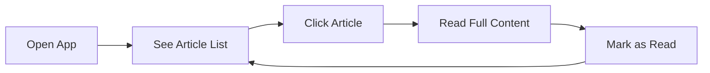
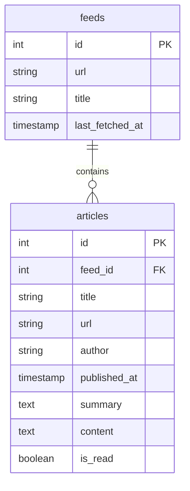

# RSS Reader PRD

A lightweight product specification for a personal RSS reader with LLM-powered content curation.

> [!NOTE]
> This is a **solo developer, personal-use project**. The goal is simplicity and maintainability over enterprise-readiness.

---

## Vision

An RSS reader that:
- **Hides** obviously uninteresting content automatically
- **Surfaces** articles matching your interests
- **Discovers** unexpected treasures — serendipitous finds you wouldn't have sought out

---

## Tech Stack (Locked In)

| Component | Choice | Rationale |
|-----------|--------|-----------|
| Backend | **FastAPI** + **SQLModel** | Lean, async, auto-docs |
| Feed parsing | **feedparser** | Mature, handles all formats |
| Scheduling | **APScheduler** | In-app, Docker-friendly |
| Database | **SQLite** | Simple, no ops |
| Frontend | **Next.js** + **Chakra UI** | Great DX, prop-based theming |
| LLM | **Ollama** (local) | Privacy, no API costs |

> [!TIP]
> **Future setup:** Add Chakra UI MCP server locally for improved dev workflow.

---

## MVP Scope

**Goal:** Single feed displayed in a working UI, running in Docker.

### MVP Features
1. **Add a single RSS feed** (hardcoded URL is fine for MVP)
2. **Fetch and display articles** in a list view
3. **Article detail view** with full content
4. **Mark as read/unread**
5. **Docker Compose setup** for backend + frontend

### MVP Deferred
- Multiple feeds / feed groups
- LLM scoring (see [LLM Scoring Vision](./llm_scoring_vision.md))
- Search / filtering
- Feed management UI

---

## User Flow (MVP)

---

## Data Model (MVP)

> [!NOTE]
> LLM scoring fields will be added in M3. Schema will evolve as we learn more about the scoring approach.

---

## Organization Principles

Rather than prescribing a detailed folder structure upfront, we follow these principles:

1. **Flat over nested** — Avoid deep nesting; keep things findable
2. **Colocation** — Keep related files together (e.g., component + its tests)
3. **Obvious naming** — File names should make purpose clear without context
4. **Grow as needed** — Start minimal, refactor when patterns emerge

---

## Testing Philosophy

Inspired by [datasette-enrichments](https://github.com/datasette/datasette-enrichments), we prioritize:

### Principles
1. **Integration over unit tests** — Test real workflows, not implementation details
2. **Fixtures for setup** — Use pytest fixtures to create test databases and app instances
3. **Async-first** — Use `pytest-asyncio` for testing async FastAPI endpoints
4. **Parametrized tests** — Cover variations (auth/no-auth, different tables) with `@pytest.mark.parametrize`
5. **Test the important paths** — Focus on feed fetching, article display, state changes (read/unread)

### What We Test
- API endpoint responses (status codes, expected data)
- Database state after operations
- Error handling for edge cases (malformed feeds, network failures)

### What We Don't Over-Invest In
- Exhaustive unit tests for simple CRUD
- Mocking everything — prefer real SQLite test databases
- UI snapshot testing (overkill for personal project)

### Tools
- **pytest** + **pytest-asyncio** for backend
- **httpx** (via FastAPI TestClient) for API testing
- Manual browser testing for UI (consider Playwright later if needed)

---

## Milestones

### M1: MVP
- Backend: FastAPI skeleton + SQLite + feedparser
- Backend: APScheduler for periodic fetch
- Frontend: Article list + detail view with Chakra UI
- Docker Compose: backend + frontend
- *Verification: defined in M1 implementation plan*

### M2: Feed Management
- Add/remove feeds via UI
- Feed groups / categories
- Filtering by feed

### M3: LLM Scoring
- See [LLM Scoring Vision](./llm_scoring_vision.md)
- Ollama integration
- Prose-style preferences storage
- Multi-stage filtering pipeline

### M4: Polish & Maintenance
- Search (FTS5)
- Keyboard shortcuts
- Mobile-responsive layout
- **Data retention / cleanup** — prevent database bloat

---

## Next Steps

1. ✅ Review this PRD
2. Create M1 implementation plan with detailed verification steps
3. Start backend skeleton
